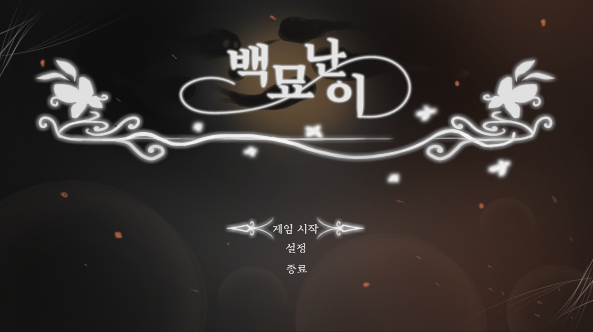
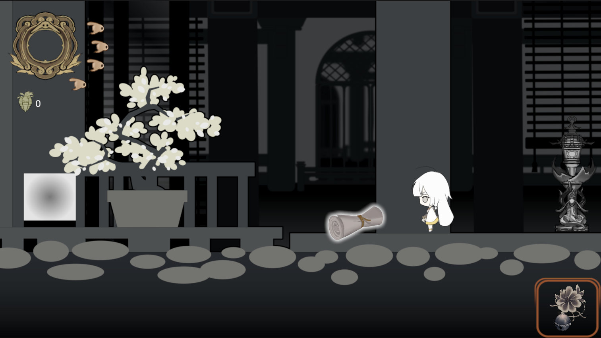
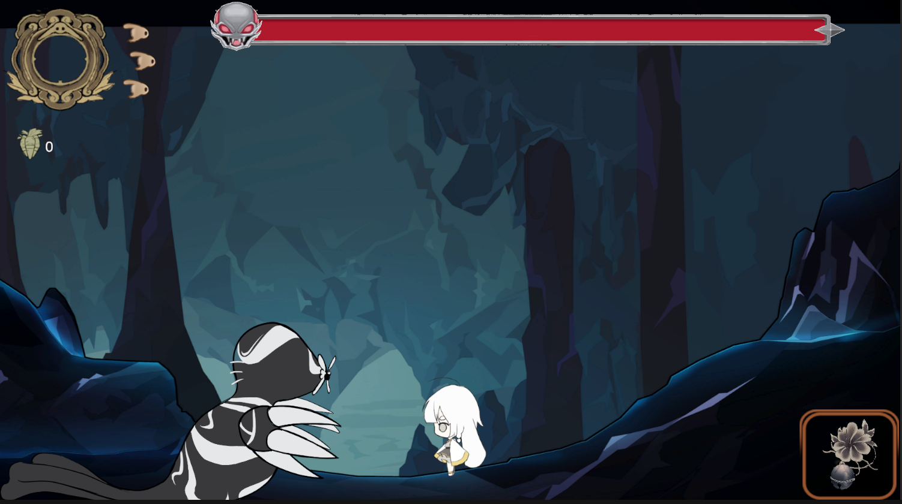

# 백묘난이

> Unity 기반으로 제작한 2D 로그라이크 액션 게임

플레이어는 다양한 적과 전투를 벌이며 전리품을 획득하고,  
캐릭터를 성장시키면서 더 강력한 전투를 진행하게 됩니다.

---

## 🎮 프로젝트 소개

- 프로젝트명 : 백묘난이
- 장르 : 2D 로그라이크 액션
- 개발 엔진 : Unity
- 개발 형태 : 팀 프로젝트
- 개발 기간 : 2025.01 ~ 2025.05
- 개발 목적 : 플레이엑스포 출품

---

## 🕹️ 게임 소개

백묘난이는 반복 플레이 기반의 2D 로그라이크 액션 게임입니다.

플레이어는 스테이지를 탐험하며 다양한 적과 전투하고,  
전리품과 강화 요소를 획득하면서 점점 더 강력한 적에게 도전하게 됩니다.

플레이엑스포 출품을 목표로 제작되었으며,  
다른 대학교 학생들과 협업하여 개발을 진행했습니다.

---

## 📸 인게임 스크린샷

### 플레이 화면

### 전투 장면

### UI 및 플레이 장면

> ※ 실제 스크린샷 이미지로 교체 예정

---

## 🎮 조작 방식

| 키 | 기능 |
|---|---|
| WASD | 이동 |
| Space Bar | 점프 |
| 좌클릭 | 기본 공격 |
| 우클릭 | 스킬 사용 |
| G | 상호작용 |
| I | 인벤토리 |

---

## ⚙️ 사용 기술

- Unity
- C#
- Git / GitHub

---

## ✨ 주요 기능

### 플레이어 전투 시스템
- 기본 공격 시스템
- 스킬 사용 시스템
- 피격 및 체력 처리
- 전투 애니메이션 연동

### 로그라이크 성장 요소
- 전리품 획득 시스템
- 캐릭터 성장 구조 구현
- 반복 플레이 기반 진행 방식 설계

### 적 AI 시스템
- 플레이어 추적
- 공격 패턴 구현
- 충돌 및 피격 판정 처리

### 상호작용 시스템
- 오브젝트 상호작용
- 아이템 획득 기능
- UI 연동 처리

---

## 🤝 협업 경험

다른 대학교 학생들과 협업하여 프로젝트를 진행했습니다.

- GitHub를 활용한 프로젝트 관리
- 역할 분담 기반 개발 진행
- 기능 구현 및 테스트 과정 공유
- 팀원 간 커뮤니케이션 경험

협업 과정에서 버전 관리와 기능 충돌 해결의 중요성을 경험할 수 있었습니다.
